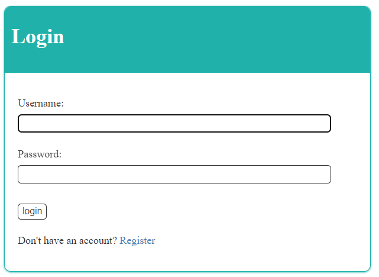
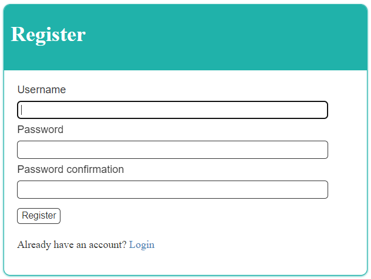
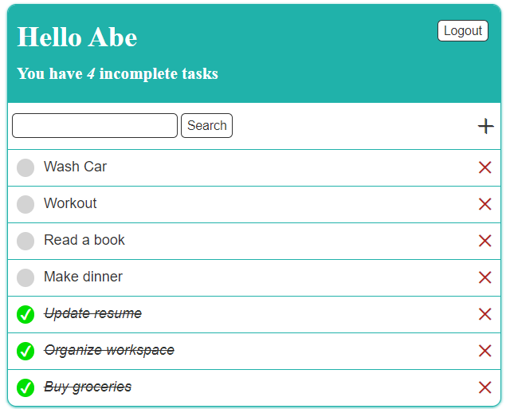
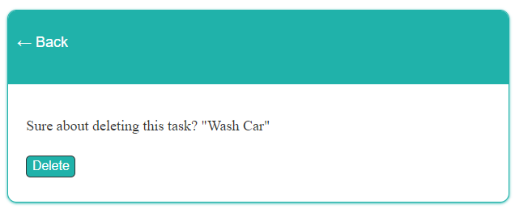
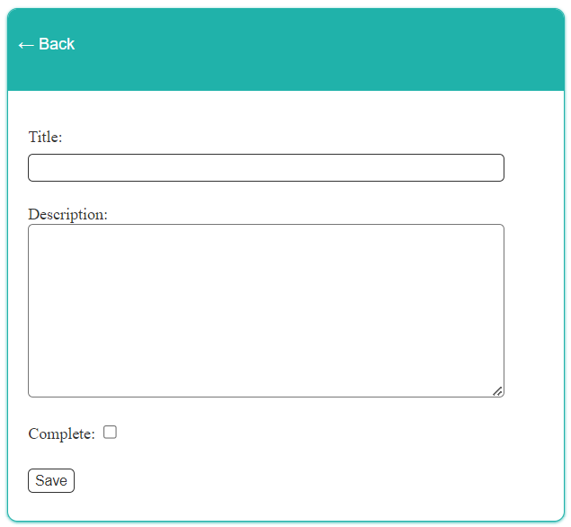

# Django Todo List Web App

Welcome to the Django Todo List web app! This project is a simple task management application built using Python, Django, and HTML. It provides basic functionalities such as user registration, login, task creation, task deletion, task listing, and task details.

## Features

- User Authentication: Register and login to access your personalized task list.
- Task Management: Add new tasks, view your tasks, and delete tasks as needed.
- Task Details: Get detailed information about each task, including task description and due date.
- User Restrictions: Users can only view, add, and delete their own tasks, ensuring privacy.

## Technologies Used

- **Python:** The core programming language used for server-side logic.
- **Django:** A high-level Python web framework for rapid development.
- **HTML:** Used for structuring the front-end and rendering templates.

## Getting Started

### Prerequisites

- [Python](https://www.python.org/) installed
- [Django](https://www.djangoproject.com/) installed (`pip install django`)

### Installation

1. Clone the repository:
   ```bash
   git clone https://https://github.com/Ab2lah/django-todolist.git
   cd django-todo-list

2. Activate the virtual environment:
   ```bash
    # On Windows:
    .\venv\Scripts\activate
    # On macOS/Linux:
    source venv/bin/activate

3. Run migrations:
   ```bash
    python manage.py migrate

4. Create a superuser for admin access:
   ```bash
    python manage.py createsuperuser

5. Run the development server:
   ```bash
    python manage.py runserver

6. Access the application at http://localhost:8000 in your browser.

### Usage
- Visit the registration page to create a new account.
- Log in with your credentials.
- Add, view, and delete tasks from the task list.
- Click on a task to view detailed information.







